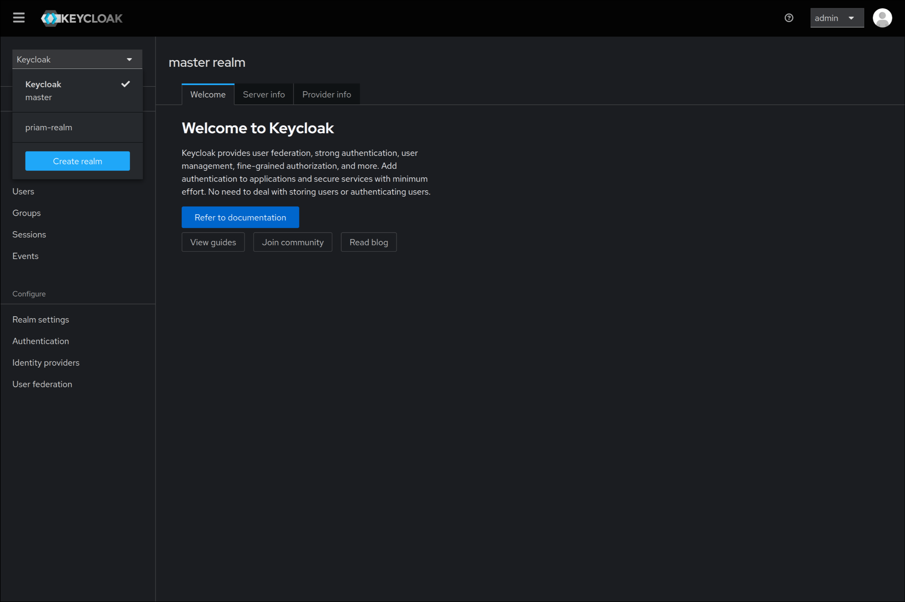
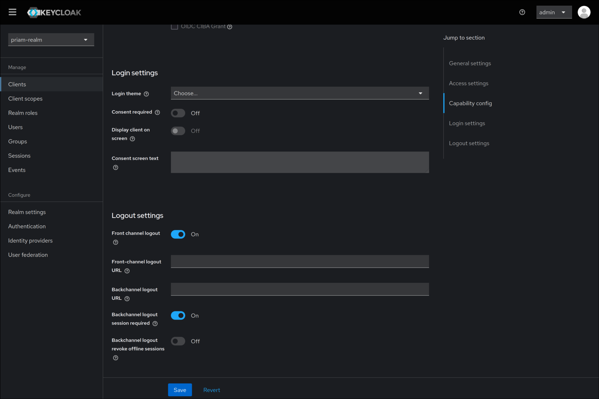
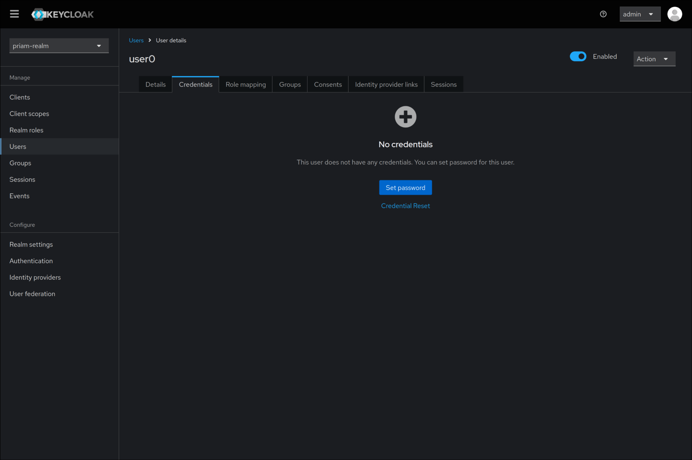
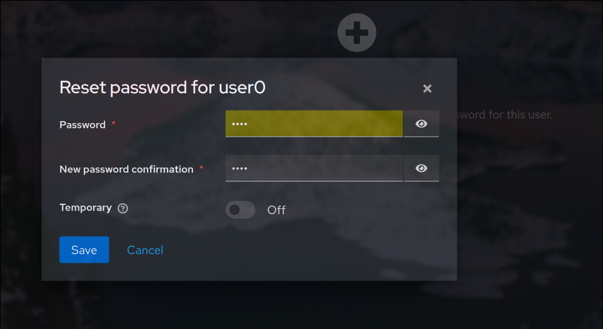

# Docker Installation

You will need:

- [Docker](https://docs.docker.com/desktop/)
- [Docker Compose](https://docs.docker.com/compose/install/) (if it is not pre-installed in your Docker installation)
- [Docker Buildx](https://github.com/docker/buildx?tab=readme-ov-file#installing) (if it is not pre-installed in your Docker installation)

> [!IMPORTANT]  
> This tutorial was created using these software versions:
>
> - Docker: `26.1.0, build 9714adc6c7`
> - Docker Compose: `2.26.1`
> - Docker Buildx: `github.com/docker/buildx 0.14.0 171fcbeb69d67c90ba7f44f41a9e418f6a6ec1da`

> [!WARNING]  
> Note that depending on your Docker version, the commands may slightly change (e.g., `docker compose` -> `docker-compose` for the standalone installation mode of Docker Compose).

---

The `docker-compose.yml` file is pre-configured for local use. The main missing configuration is for Keycloak.

First, create a `.env` file in the root directory of the project.

This configuration is shared between the `mysql` and `keycloak` Docker containers.

A simple local configuration looks like this:

```env
MYSQL_ALLOW_EMPTY_PASSWORD=true
KEYCLOAK_ADMIN=admin
KEYCLOAK_ADMIN_PASSWORD=admin
```

> [!TIP]  
> For any advanced configuration, I recommend following the documentation for [MySQL](https://hub.docker.com/_/mysql) and [Keycloak](https://www.keycloak.org/getting-started/getting-started-docker).

## Keycloak Configuration

Start the services for the first time using this command:

```bash
docker compose up -d
```

Next, we will access Keycloak.

Go to the page `http://localhost:8080`. You should see a page like this:



Now click on "create realm" and you will see this page:


Copy exactly what is on the page, then go to `realm settings` at the bottom right:


The page should look like this. Click on `Create attribute`:


You will see this page. Fill it out exactly as shown, then go to the `Clients` page. By the end of this section, it should look like this:


Click on `Create client` and fill out the page exactly as shown:




Now we will create the users. Start by going to the `Users` page on the left. By the end of this section, you will have these two users appearing:


Click on `Add user` and copy the values exactly as shown.


Now you need to do exactly the same for `user1`:


Next, we need to create login credentials for user 0. Go back to `user0` and go to `Credentials`:



Click on `Set password` and fill out the page as shown:




Choose a password that you will remember!

## Launch

Finally, restart the services using the command below:

```bash
docker compose up -d --force-recreate
```

This will restart all services and connect them together properly!

Now PRIAM is fully configured.
